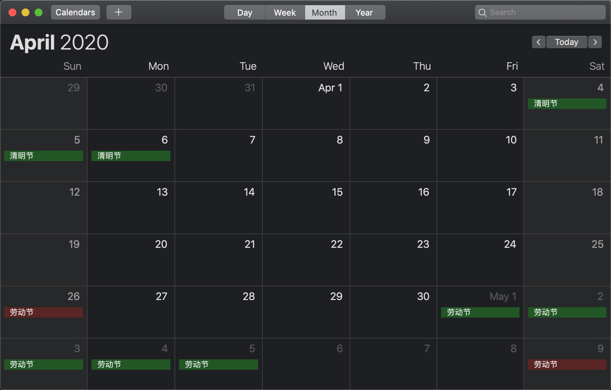
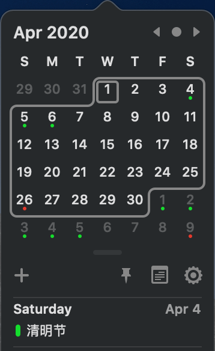

# Calendar
法定节假日 iCalendar 订阅服务

[![Docker build][build-image]][hub-url]
[![Docker pulls][pulls-image]][hub-url]
[![Docker stars][stars-image]][hub-url]
[![Docker size][size-image]][size-url]

#### calendar


#### itsycal


## Subscription

本服务分为两个日历，`节假日` 和 `调休`，以便可以分别设置提醒和区分颜色

MacOS 打开 `日历`，左上角 `文件` - `新建日历订阅`，添加如下地址订阅

- 节假日: `https://calendar.2huo.us/off`
- 调休: `https://calendar.2huo.us/work`

## Docker

自建订阅服务
```bash
docker pull ghcr.io/secbone/calendar:master

docker run -d -p [port]:80 ghcr.io/secbone/calendar:master
```

## Thanks

- [NateScarlet/holiday-cn](https://github.com/NateScarlet/holiday-cn)

[pulls-image]: https://img.shields.io/docker/pulls/secbone/calendar.svg?style=flat-square
[hub-url]: https://hub.docker.com/r/secbone/calendar/
[stars-image]: https://img.shields.io/docker/stars/secbone/calendar.svg?style=flat-square
[size-image]: https://images.microbadger.com/badges/image/secbone/calendar.svg
[size-url]: https://microbadger.com/images/secbone/calendar
[build-image]: https://img.shields.io/docker/cloud/build/secbone/calendar.svg?style=flat-square
